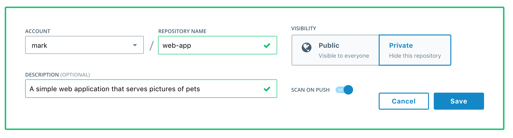

# Lab X: Securing Applications with Docker Enterprise

In this lab you will integrate Docker Enterprise in to your development pipeline. You will build your application from a Dockerfile and push your image to the Docker Trusted Registry (DTR). DTR will scan your image for vulnerabilities so they can be fixed before your application is deployed. This helps you build more secure apps!


> **Difficulty**: Beginner

> **Time**: Approximately 30 minutes


> **Tasks**:
>
> * [Prerequisites](#prerequisites)
> * [Task 1: Build a Docker Application](#task1)
>   * [Task 1.1: Inspect the App Source](#task1.1)
>   * [Task 1.2: Build the Application Image](#task1.2)
>   * [Task 1.3: Deploy the App Locally](#task1.3)
> * [Task 2: Pushing and Scanning Docker Images](#task2)
>   * [Task 2.1: Creating a Repo](#task2.1)
>   * [Task 2.2: Pushing to DTR](#task2.2)
>   * [Task 2.3: Deploying the Visualizer App](#task2.3)
>   * [Task 2.4: Self-Healing Applications](#task2.4)
> * [Task 3: Remediating a Security Vulnerability](#task3)
>   * [Task 3.1: Deploying a Stateful Service ](#task3.1)
>   * [Task 3.2: Configuring Application Secrets](#task3.2)
>   * [Task 3.3: Using Healthchecks to Control Application Lifecycle](#task3.3)
>   * [Task 3.4: Upgrading with a Rolling Update](#task3.4)

## Document conventions

When you encounter a phrase in between `<` and `>`  you are meant to substitute in a different value. 

For instance if you see `ssh <username>@<hostname>` you would actually type something like `ssh labuser@v111node0-adaflds023asdf-23423kjl.appnet.com`

You will be asked to SSH into various nodes. These nodes are referred to as **v111node0**, **v111node1** etc. These tags correspond to the very beginning of the hostnames you will find in your welcome email. 

## <a name="prerequisites"></a>Prerequisites

This lab requires an instance of Docker Trusted Registry. This lab provides DTR for you. If you are creating this lab yourself then you can see how to install DTR [here.](https://docs.docker.com/datacenter/dtr/2.2/guides/admin/install/)

In addition to DTR, this lab requires a node with Docker EE 17.03+ installed. You will use this node to build and deploy your application.


## <a name="task1"></a>Task 1: Build and Running a Docker Application
The following task will guide you through how to build your app from a Dockerfile.

### <a name="task1.1"></a>Task 1.1: Inspect the App Source


1. Log in to one of your hosts. The first host that we log on to will be your UCP controller.

```
$ ssh -i <indentity file> ubuntu@<ducp-0 public ip>
```

2. Check to make sure you are running the correct Docker version. At a minimum you should be running `17.03 EE`

```
$ docker version
Client:
 Version:      17.03.0-ee-1
 API version:  1.26
 Go version:   go1.7.5
 Git commit:   9094a76
 Built:        Wed Mar  1 01:20:54 2017
 OS/Arch:      linux/amd64

Server:
 Version:      17.03.0-ee-1
 API version:  1.26 (minimum version 1.12)
 Go version:   go1.7.5
 Git commit:   9094a76
 Built:        Wed Mar  1 01:20:54 2017
 OS/Arch:      linux/amd64
 Experimental: false
 
```

3. Clone your application from the [GitHub repo.](https://github.com/mark-church/docker-pets) Go to the `/web` directory. This is the directory that holds the source for our application.

```
$ git clone https://github.com/mark-church/docker-pets
$ cd docker-pets/web
```

Inspect the directory.

```
$ ls
Dockerfile  admin.py    app.py      static/     templates/
```

- `admin.py` & `app.py` are the source code files for our Python application.
- `/static` & `/templates` hold the static content, such as pictures and HTML, for our app.
- `Dockerfile` is the configuration file we will use to build our app.


4. Inspect contents of the `Dockerfile`.


```
$ cat Dockerfile
FROM alpine:3.4

RUN apk --no-cache add py-pip libpq python-dev curl

RUN pip install flask==0.10.1 python-consul

ADD / /app

WORKDIR /app

HEALTHCHECK CMD curl --fail http://localhost:5000/health || exit 1

CMD python app.py & python admin.py
```

Our Dockerfile includes a couple notable lines:

- `FROM alpine:3.4` indicates that our applicaiton is based off of an Alpine OS base image.
- `RUN apk` & `RUN pip` lines install software packages on top of the base OS that our applications needs.
- `ADD / /app` adds the application code into the image.

### <a name="task1.2"></a>Task 1.2: Build the Application Image

1. Build the image from the Dockerfile. You are going to specify an image tag `web-app` that you will reference this image by later. The `.` in the command indicates that you are building from the current directory. Docker will automatically build off of any file in the directory named `Dockerfile`.

```
$ docker build -t web-app --no-cache .
Sending build context to Docker daemon 26.55 MB
Step 1/7 : FROM alpine:3.4
 ---> baa5d63471ea
Step 2/7 : RUN apk --no-cache add py-pip libpq python-dev curl
 ---> Running in 382419b97267
fetch http://dl-cdn.alpinelinux.org/alpine/v3.4/main/x86_64/APKINDEX.tar.gz
...
...
...
```

It should not take more than a minute to build the image.

### <a name="task1.2"></a>Task 1.3: Deploy the App Locally

You will now deploy the image locally to ensure that it works. Before you do this you need to turn Swarm mode on in your engine so that we can take advantage of Docker Services.

1. Establish a Swarm.

```
$ docker swarm init
```

Confirm that you now have a Swarm cluster of a single node.

```
$ docker node ls
ID                           HOSTNAME  STATUS  AVAILABILITY  MANAGER STATUS
fd3ovikiq7tzmdr70zukbsgbs *  moby      Ready   Active        Leader
```

2. Deploy your application from the compose file. In the `/docker-pets` directory there is a compose file that you will use to deploy this application. You will deploy your application stack as `pets`.

```
$ docker stack deploy -c pets-dev-compose.yml pets
Creating network pets_backend
Creating service pets_web
Creating service pets_db
```

3. Go to your browser and in the address pane type in `<node-public-ip`>:5000`. This is the address and port where the app is being served. If you see something similar to the following then it is working correctly. It may take up to a minute for the app to start up, so try to refresh until it works.

 

## <a name="task2"></a>Task 2: Pushing and Scanning Docker Images

### <a name="Task 2.1"></a>Task 2.1: Creating a Repo

Docker Trusted Registry (DTR) is the enterprise-grade image storage solution from Docker. You install it behind your firewall so that you can securely store and manage the Docker images you use in your applications.

In this lab, DTR has already been set up for you so you will log in to it and use it.

1. Log in to DTR. Before the lab you should have been assigned a cluster and a username. Use these when logging in.

Go to `<cluster-name>.dtr.dckr.org` and login with your given username and password. You should see the DTR home screen.

 

2. Before you can push an image to DTR you must create a repository. Click on Repositories / New repository. For account, pick your username. The repository will be `web-app` (the same as the image name). Give it a simple description and mark the repo as Private. This will make the repo visible only to those that are granted access (which right now is only you). Ensure that "Scan on Push" is checked to On. When this is checked, images pushed to this repo will be scanned for vulnerabilities automatically.

 

3. Click Save. If you click on the `<account>/web-app` repo you'll see that it is empty as we have not pushed any images to it yet.


### <a name="Task 2.1"></a>Task 2.2: Pushing to DTR

Next we will push our local image to DTR. First we will need to authenticate with DTR so that our local engine trusts it. We will use a simple tool that pulls certificates from DTR to our development node.

1. Run the following command. Insert the name of your assigned cluster in the command.

```
$ docker run -it --rm \
  -v /etc/docker:/etc/docker \
  mbentley/trustdtr <cluster>.dtr.dckr.org
Using the root CA certificate for trusting DTR
Adding certificate to '/etc/docker/certs.d/dtr.church.dckr.org/ca.crt'...done
Verifying format of certificate...done
```

2. Log in to DTR with your username.

```
$ docker login <cluster>.dtr.dckr.org
Username: <username>
Password:
Login Succeeded
```
  
3. Tag your image with the name registry and repo you are pushing to. Input your username and cluster.

```
$ docker tag web-app:1.0 <cluster>.dtr.dckr.org/<username>/web-app:1.0
```

4. Push your image to DTR.

```
$ docker push <cluster>.dtr.dckr.org/<username>/web-app:1.0
The push refers to a repository [dtr.church.dckr.org/mark/web-app]
273eb8eab1c9: Pushed
7d68ed329d0d: Pushed
02c1439e0fdc: Pushed
9f8566ee5135: Pushed
1.0: digest: sha256:809c6f80331b9d03cb099b43364b7801826f78ab36b26f00ea83988fbefb6cac size: 1163
```

5. Go to the DTR GUI and go to your `web-app` repo. You should see that your image has been pushed and a security vulnerability scan has started on it.

6.
